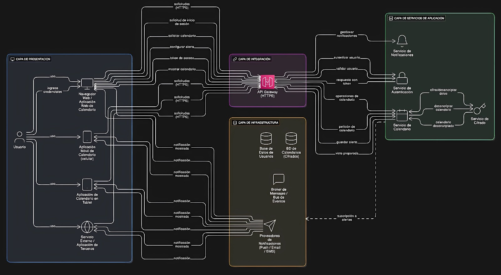

# Sistema de Calendario - Arquitectura en Capas

Sistema de gestión de calendarios con autenticación JWT, cifrado de datos sensibles y sistema de notificaciones asíncrono.

[](https://app.swaggerhub.com/apis/udla-52c/api-sistema-de-calendario/1.0.0)
[](https://www.java.com)
[](https://spring.io/projects/spring-boot)

## 🔗 Enlaces Importantes

- **API Documentation (SwaggerHub)**: [https://app.swaggerhub.com/apis/udla-52c/api-sistema-de-calendario/1.0.0](https://app.swaggerhub.com/apis/udla-52c/api-sistema-de-calendario/1.0.0)
- **Swagger UI Local**: http://localhost:8080/swagger-ui.html (después de ejecutar)
- **H2 Console**: http://localhost:8080/h2-console (después de ejecutar)

## 📊 Diagrama de Arquitectura



*Diagrama completo del sistema mostrando las 4 capas: Presentación, Integración, Servicios e Infraestructura*

## 📋 Descripción del Proyecto

Sistema multinacional de calendario accesible desde múltiples plataformas (web, móvil, tablet, servicios externos) con las siguientes características:

- ✅ **Autenticación segura** con JWT
- ✅ **Cifrado de datos sensibles** en reposo (AES)
- ✅ **Control de acceso** basado en permisos
- ✅ **Sistema de notificaciones** (Push, Email, SMS)
- ✅ **Arquitectura en capas** escalable
- ✅ **API RESTful** documentada con OpenAPI/Swagger

## 🏗️ Arquitectura

### Estilo Arquitectónico
- **Principal**: Arquitectura en Capas (Layered Architecture)
- **Complementario**: Arquitectura Orientada a Servicios (SOA)
- **Patrón**: API Gateway

### Capas del Sistema

```
┌─────────────────────────────────────────────────────────────┐
│  CAPA DE PRESENTACIÓN                                       │
│  - Navegador Web                                            │
│  - Aplicación Móvil                                         │
│  - Aplicación Tablet                                        │
│  - Servicios Externos / APIs de Terceros                    │
└──────────────────────┬──────────────────────────────────────┘
                       │ HTTPS
┌──────────────────────▼──────────────────────────────────────┐
│  CAPA DE INTEGRACIÓN                                        │
│  API Gateway (HTTPS)                                        │
│  Endpoints:                                                 │
│  - POST /auth/login                                         │
│  - GET  /calendar                                           │
│  - POST /alerts                                             │
│  - POST /notifications/shown                                │
└──────────────────────┬──────────────────────────────────────┘
                       │
┌──────────────────────▼──────────────────────────────────────┐
│  CAPA DE SERVICIOS DE APLICACIÓN                           │
│  ┌────────────────┐ ┌──────────────┐ ┌──────────────────┐  │
│  │ Servicio       │ │ Servicio     │ │ Servicio         │  │
│  │ Autenticación  │ │ Calendario   │ │ Notificaciones   │  │
│  └────────────────┘ └──────────────┘ └──────────────────┘  │
│                    ┌──────────────┐                         │
│                    │ Servicio     │                         │
│                    │ Cifrado      │                         │
│                    └──────────────┘                         │
└──────────────────────┬──────────────────────────────────────┘
                       │
┌──────────────────────▼──────────────────────────────────────┐
│  CAPA DE INFRAESTRUCTURA                                    │
│  ┌───────────────┐ ┌────────────────────┐ ┌──────────────┐ │
│  │ BD Usuarios   │ │ BD Calendarios     │ │ Broker       │ │
│  │               │ │ (Cifrados)         │ │ Mensajes     │ │
│  └───────────────┘ └────────────────────┘ └──────────────┘ │
│                                                              │
│  ┌──────────────────────────────────────────────────────┐  │
│  │ Proveedores de Notificaciones (Push/Email/SMS)       │  │
│  └──────────────────────────────────────────────────────┘  │
└─────────────────────────────────────────────────────────────┘
```

## 🚀 Tecnologías

- **Backend**: Java 17 + Spring Boot 3.1.5
- **Seguridad**: Spring Security + JWT
- **Persistencia**: Spring Data JPA + H2 (dev) / PostgreSQL (prod)
- **Mensajería**: RabbitMQ (AMQP)
- **Documentación**: SpringDoc OpenAPI 3 (Swagger)
- **Build**: Maven

## 📦 Estructura del Proyecto

```
src/
├── main/
│   ├── java/org/example/
│   │   ├── CalendarioApplication.java       # Clase principal
│   │   ├── model/                           # Entidades JPA
│   │   │   ├── Usuario.java
│   │   │   ├── Calendario.java
│   │   │   ├── EventoCalendario.java
│   │   │   └── Alerta.java
│   │   ├── repository/                      # Repositorios JPA
│   │   │   ├── UsuarioRepository.java
│   │   │   ├── CalendarioRepository.java
│   │   │   ├── EventoRepository.java
│   │   │   └── AlertaRepository.java
│   │   ├── dto/                             # Data Transfer Objects
│   │   │   ├── LoginRequest.java
│   │   │   ├── AuthResponse.java
│   │   │   ├── CalendarioRequest.java
│   │   │   ├── CalendarioResponse.java
│   │   │   ├── EventoRequest.java
│   │   │   ├── EventoResponse.java
│   │   │   ├── AlertaRequest.java
│   │   │   └── AlertaResponse.java
│   │   ├── service/                         # Capa de Servicios
│   │   │   ├── AuthService.java
│   │   │   ├── CalendarService.java
│   │   │   ├── NotificationService.java
│   │   │   ├── EncryptionService.java
│   │   │   └── MessageBrokerService.java
│   │   ├── security/                        # Seguridad JWT
│   │   │   ├── JwtUtil.java
│   │   │   ├── JwtAuthenticationFilter.java
│   │   │   ├── CustomUserDetailsService.java
│   │   │   └── SecurityConfig.java
│   │   ├── controller/                      # API Gateway Controllers
│   │   │   ├── AuthController.java
│   │   │   ├── CalendarController.java
│   │   │   └── NotificationController.java
│   │   └── config/                          # Configuraciones
│   │       ├── OpenAPIConfig.java
│   │       ├── AlertScheduler.java
│   │       └── AppConfig.java
│   └── resources/
│       └── application.yml                  # Configuración de la app
├── diagrama.xml                             # Diagrama de arquitectura XML
├── openapi-spec.yaml                        # Especificación OpenAPI
└── RESTRICCIONES_ARQUITECTURA.md            # Documento de restricciones
```

## 🔧 Instalación y Configuración

### Prerrequisitos

1. **Java 17** o superior
2. **Maven 3.6+**
3. **RabbitMQ** (opcional, el sistema funciona sin él con logs)

### Instalación

```bash
# Clonar el repositorio (si aplica)
git clone <repository-url>
cd Servicio_Calendario

# Compilar el proyecto
mvn clean install

# Ejecutar la aplicación
mvn spring-boot:run
```

### Configuración de RabbitMQ (Opcional)

Si deseas habilitar las notificaciones asíncronas:

```bash
# Instalar RabbitMQ con Homebrew (macOS)
brew install rabbitmq

# Iniciar RabbitMQ
brew services start rabbitmq

# Acceder a la consola de administración
# http://localhost:15672
# Usuario: guest
# Password: guest
```

La aplicación detecta automáticamente si RabbitMQ está disponible. Si no lo está, simula el envío de mensajes con logs.

## 📚 Uso de la API

### 1. Acceder a Swagger UI

Una vez iniciada la aplicación, accede a:

```
http://localhost:8080/swagger-ui.html
```

### 2. Registro de Usuario

```bash
curl -X POST http://localhost:8080/auth/register \
  -H "Content-Type: application/json" \
  -d '{
    "username": "juan.perez",
    "password": "Password123!",
    "email": "juan.perez@email.com",
    "nombre": "Juan Pérez"
  }'
```

### 3. Login (Obtener Token JWT)

```bash
curl -X POST http://localhost:8080/auth/login \
  -H "Content-Type: application/json" \
  -d '{
    "username": "juan.perez",
    "password": "Password123!"
  }'
```

**Respuesta**:
```json
{
  "token": "eyJhbGciOiJIUzUxMiJ9...",
  "tipo": "Bearer",
  "usuarioId": 1,
  "username": "juan.perez",
  "email": "juan.perez@email.com"
}
```

### 4. Crear Calendario

```bash
curl -X POST http://localhost:8080/calendar \
  -H "Content-Type: application/json" \
  -H "Authorization: Bearer {TOKEN}" \
  -d '{
    "nombre": "Calendario Personal",
    "descripcion": "Mis eventos personales",
    "color": "#3788d8",
    "publico": false
  }'
```

### 5. Agregar Evento

```bash
curl -X POST http://localhost:8080/calendar/events \
  -H "Content-Type: application/json" \
  -H "Authorization: Bearer {TOKEN}" \
  -d '{
    "titulo": "Reunión importante",
    "descripcion": "Información confidencial del proyecto",
    "fechaInicio": "2024-12-01T10:00:00",
    "fechaFin": "2024-12-01T11:30:00",
    "ubicacion": "Sala de juntas",
    "todoElDia": false,
    "tipo": "EVENTO_LABORAL",
    "calendarioId": 1
  }'
```

### 6. Configurar Alerta

```bash
curl -X POST http://localhost:8080/alerts \
  -H "Content-Type: application/json" \
  -H "Authorization: Bearer {TOKEN}" \
  -d '{
    "eventoId": 1,
    "fechaAlerta": "2024-12-01T09:45:00",
    "tipoNotificacion": "PUSH",
    "minutosAnticipacion": 15,
    "mensaje": "Recordatorio: Reunión en 15 minutos"
  }'
```

### 7. Obtener Calendarios

```bash
curl -X GET http://localhost:8080/calendar \
  -H "Authorization: Bearer {TOKEN}"
```

### 8. Ver Calendario (Vista Preparada)

```bash
curl -X GET "http://localhost:8080/calendar/view?id=1" \
  -H "Authorization: Bearer {TOKEN}"
```

## 🔒 Seguridad

### Autenticación JWT

- **Algoritmo**: HS512
- **Expiración**: 24 horas
- **Header**: `Authorization: Bearer {token}`

### Cifrado de Datos

- **Algoritmo**: AES (Advanced Encryption Standard)
- **Alcance**: Calendarios y eventos con información sensible
- **Proceso**:
  1. Datos sensibles se cifran antes de almacenar
  2. Solo usuarios autorizados pueden descifrar
  3. Descifrado automático en vista preparada

### Control de Acceso

- Usuario solo puede ver **sus propios calendarios**
- Usuario puede ver calendarios **públicos**
- Usuario solo puede configurar alertas en **sus propios eventos**

## 🔔 Sistema de Notificaciones

### Flujo de Notificaciones

1. Usuario configura alerta (POST /alerts)
2. Alerta se guarda en BD
3. Evento se publica en RabbitMQ
4. Scheduler revisa alertas cada 60 segundos
5. Cuando llega la hora, envía notificación al proveedor
6. Proveedor entrega la notificación
7. Aplicación cliente confirma (POST /notifications/shown)

### Tipos de Notificación

- **PUSH**: Notificaciones push a aplicaciones móviles
- **EMAIL**: Correo electrónico
- **SMS**: Mensajes de texto

## 📖 Documentación

### Swagger/OpenAPI

- **Swagger UI**: http://localhost:8080/swagger-ui.html
- **OpenAPI JSON**: http://localhost:8080/api-docs
- **OpenAPI YAML**: Ver archivo `openapi-spec.yaml`

### SwaggerHub

**API Publicada**: [https://app.swaggerhub.com/apis/udla-52c/api-sistema-de-calendario/1.0.0](https://app.swaggerhub.com/apis/udla-52c/api-sistema-de-calendario/1.0.0)

✅ **La API ya está publicada en SwaggerHub** - Puedes acceder directamente al enlace de arriba para:
- Ver la documentación interactiva completa
- Probar los endpoints en vivo
- Generar código cliente en múltiples lenguajes
- Compartir con tu equipo

**Si necesitas actualizarla**:

1. Acceder a https://app.swaggerhub.com
2. Editar la API existente
3. Importar/actualizar con el archivo `openapi-spec.yaml`

### Diagrama de Arquitectura

**Archivos disponibles**:
- **Imagen**: `Diagramas/Diagrama.jpeg` - Representación visual completa de la arquitectura
- **XML**: `Diagramas/diagrama.xml` - Especificación técnica en formato XML

El diagrama muestra:
- 4 capas arquitectónicas (Presentación, Integración, Servicios, Infraestructura)
- Componentes y servicios en cada capa
- Flujos de comunicación entre componentes
- Protocolos utilizados (HTTPS, AMQP, SQL)
- Seguridad y cifrado

### Restricciones de Arquitectura

Ver documento completo: `RESTRICCIONES_ARQUITECTURA.md`

**Restricciones Principales**:
1. Separación estricta de capas
2. Autenticación JWT obligatoria
3. Cifrado de datos sensibles
4. HTTPS en producción
5. Control de acceso basado en permisos
6. Mensajería asíncrona con RabbitMQ
7. Arquitectura stateless

## 🗃️ Base de Datos

### H2 Console (Desarrollo)

```
URL: http://localhost:8080/h2-console
JDBC URL: jdbc:h2:mem:calendardb
Username: sa
Password: (dejar vacío)
```

### Entidades

- **usuarios**: Usuarios del sistema
- **calendarios**: Calendarios (con datos cifrados)
- **eventos**: Eventos de calendarios
- **alertas**: Alertas configuradas por usuarios

## 🧪 Testing

### Probar con Swagger UI

1. Ir a http://localhost:8080/swagger-ui.html
2. Hacer POST /auth/register para crear usuario
3. Hacer POST /auth/login para obtener token
4. Hacer clic en "Authorize" y pegar el token
5. Probar los demás endpoints

### Colección Postman

Importar la especificación OpenAPI en Postman:

1. Abrir Postman
2. Import → Link → http://localhost:8080/api-docs
3. Se crearán automáticamente todos los endpoints

## 📊 Monitoreo

### Logs

Los logs se muestran en la consola con información de:
- Autenticación de usuarios
- Creación de calendarios y eventos
- Configuración de alertas
- Envío de notificaciones
- Errores y excepciones

### Scheduler de Alertas

El scheduler ejecuta cada 60 segundos y registra:
```
Procesando alertas pendientes...
Enviando notificación PUSH: ...
Enviando notificación EMAIL: ...
Enviando notificación SMS: ...
```

## 🎯 Endpoints Principales

| Método | Endpoint | Descripción | Autenticación |
|--------|----------|-------------|---------------|
| POST | /auth/login | Iniciar sesión | No |
| POST | /auth/register | Registrar usuario | No |
| POST | /auth/token | Validar token | Sí |
| GET | /calendar | Obtener calendarios | Sí |
| GET | /calendar/view | Vista preparada | Sí |
| POST | /calendar | Crear calendario | Sí |
| POST | /calendar/events | Agregar evento | Sí |
| GET | /alerts | Obtener alertas | Sí |
| POST | /alerts | Configurar alerta | Sí |
| POST | /notifications/shown | Confirmar entrega | Sí |

## 🌐 Despliegue en Producción

### Configuraciones Necesarias

1. **Base de Datos**: Cambiar de H2 a PostgreSQL/MySQL
2. **RabbitMQ**: Configurar cluster para alta disponibilidad
3. **HTTPS**: Configurar certificados SSL/TLS
4. **Secrets**: Usar variables de entorno para JWT secret y encryption key
5. **Escalamiento**: Desplegar múltiples instancias (stateless)

### Variables de Entorno

```bash
export JWT_SECRET=<secret-key-base64>
export ENCRYPTION_KEY=<encryption-key>
export DB_URL=<database-url>
export DB_USERNAME=<db-username>
export DB_PASSWORD=<db-password>
export RABBITMQ_HOST=<rabbitmq-host>
export RABBITMQ_PORT=5672
```

## 📝 Respuestas a las Preguntas del Ejercicio

### a) Modelado de Arquitectura

✅ **Archivo**: `diagrama.xml`

Arquitectura en capas con:
- **Capa de Presentación**: Múltiples plataformas
- **Capa de Integración**: API Gateway HTTPS
- **Capa de Servicios**: Autenticación, Calendario, Notificaciones, Cifrado
- **Capa de Infraestructura**: BD, Broker, Proveedores externos

### b) Restricciones de la Solución

✅ **Archivo**: `RESTRICCIONES_ARQUITECTURA.md`

Documento completo con 10 categorías de restricciones:
1. Restricciones Generales
2. Restricciones de Seguridad
3. Restricciones de Permisos
4. Restricciones de Infraestructura
5. Restricciones de Escalabilidad
6. Restricciones de Disponibilidad
7. Restricciones de Interoperabilidad
8. Restricciones de Plataforma
9. Restricciones Técnicas
10. Limitaciones Conocidas

### c) Diseño de APIs en SwaggerHub

✅ **Archivo**: `openapi-spec.yaml`

Especificación OpenAPI 3.0 completa con:
- Todos los endpoints documentados
- Schemas de request/response
- Ejemplos de uso
- Autenticación JWT
- Listo para importar en SwaggerHub

**Para importar en SwaggerHub**:
1. Acceder a https://app.swaggerhub.com
2. Create New → Import and Document API
3. Subir el archivo `openapi-spec.yaml`

## 🤝 Contribución

El proyecto está completo y funcional. Incluye:
- ✅ Código fuente completo
- ✅ Documentación exhaustiva
- ✅ Especificación OpenAPI
- ✅ Diagrama de arquitectura
- ✅ Documento de restricciones

## 📄 Licencia

Proyecto académico - Sistema de Calendario

